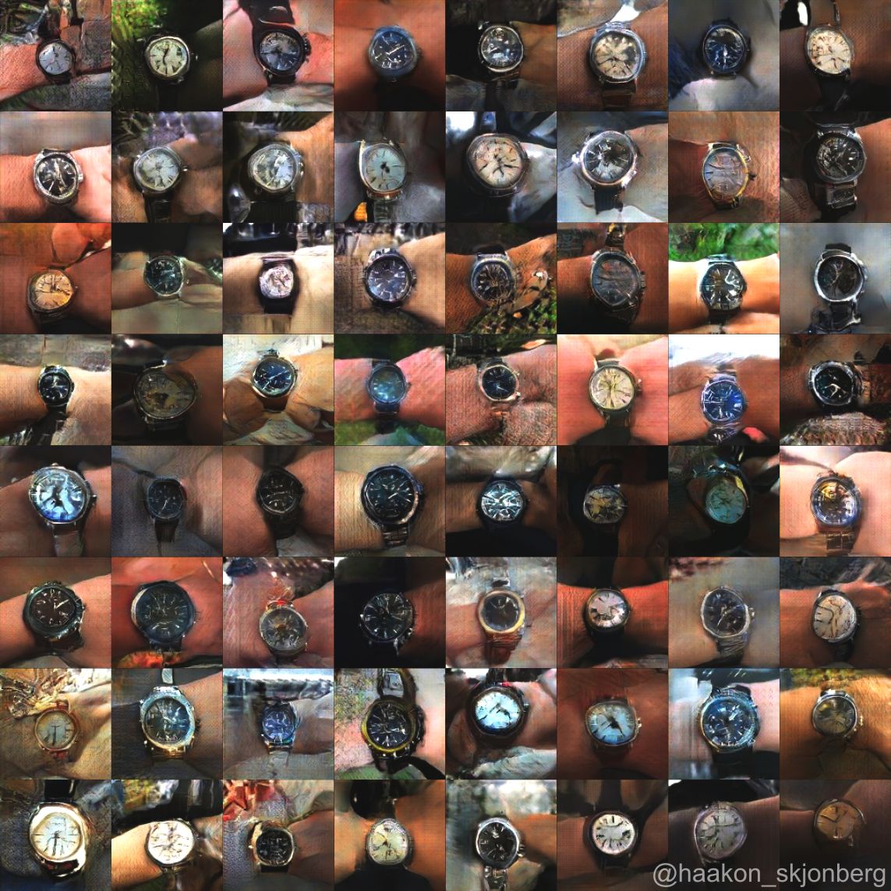

# Example GAN

Example of a basic GAN. Used to produce the following images after 72 hours of training on a 1080 Ti. A dataset of 50,000+ watch images was used. This project was built years ago and doesn't stand up to projects like StyleGAN (obviously, lol), but it is a good example of how basic GAN functions.

## How to use

By default, this GAN expects images in the following dimensions: 128x128. For simplicity, I am including a standardize.py file in the repo which resizes your image dataset to those dimensions, saving them to a new folder. That said, it is probably better to save them to a pickle file instead.

Once the requirements to run the project are satisfied, run `python standardize.py`. This will take the images from assets/dataset/original, resize them to 128x128, and save them to assets/dataset/resized. Once this is done, run `python gan.py` to begin training.

Your output will be saved to assets/examples/gan_output.

## Be aware

The images included in the /assets/dataset are meant for you to test run the GAN. If you train on these images, you will get cats, but the model will overfit as the dataset is too small. To get anything really beneficial, you need to train on large datasets. If you want to build a large image dataset, [here is a repo I built (in Ruby) to do such a thing](https://github.com/MathiasPfeil/Reddit-Image-Downloader).

It is also important to note that tensorflow can be somewhat difficult to install. There is a very good chance that running `pip install -r requirements.txt` will not work. For a more in depth installation process, [go here](https://www.tensorflow.org/install/pip).

## Requirements

* Python 3.7.3
* Tensorflow 2.0.0-beta1
* numpy 1.16.4
* cv2 4.0.0